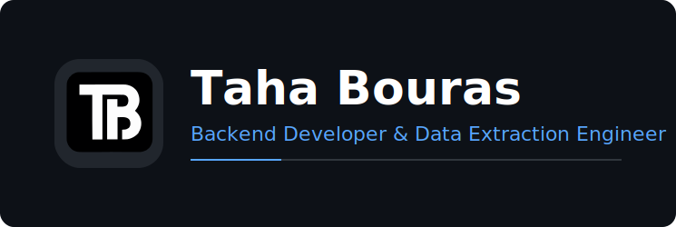

<!-- Header Banner -->

  

### 
Engineering resilient data extraction engines & robust web architectures 👨‍💻

 

<!-- Intro Section -->

  
  Senior Full Stack Engineer, specializing in **High-Throughput Data Mining**, **Advanced WordPress Plugin Development**, and **AI-Powered Automation**. 
  
  I build systems capable of navigating complex bot-detection environments, integrating **AI SDKs** for business intelligence, and developing custom enterprise-grade WordPress solutions.

 

<!-- Bullet Points -->
- 🤖 **AI & Automation:** Developing intelligent agents using **LangChain**, **Vercel AI SDK**, and Next.js.
- 🔌 **WordPress:** Engineering complex custom plugins, WooCommerce extensions, and secure API bridges.
- 🛡️ **Specialization:** Protocol analysis, TLS fingerprinting, and bypassing advanced traffic-filtering mechanisms.
- 🚀 **Core Stack:** Python, FastAPI, Next.js, TypeScript, & Docker.
- 📫 **Reach me at:** [tahadevbou@gmail.com](mailto:tahadevbou@gmail.com)

 

<!-- Tech Stack Section -->
<h3 align="center">🛠️ Technical Toolbox</h3>

  <!-- Standard Stack via SkillIcons -->
  

  <!-- Specialized Tools via Shields.io (Stable & Styled) -->
   
  
  
  
  
  
  
  

 

<!-- Stats Section - Snake Only -->
<h3 align="center">📊 Contribution Activity</h3>

  

 

<!-- Footer / Socials -->

 
  
  
  

